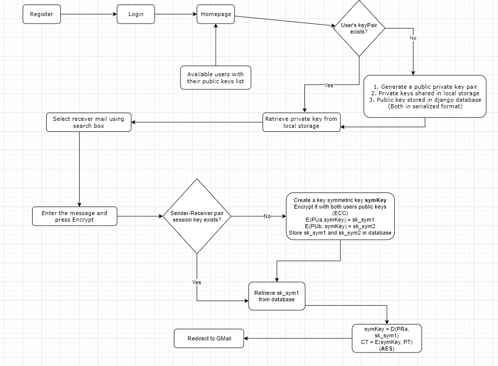
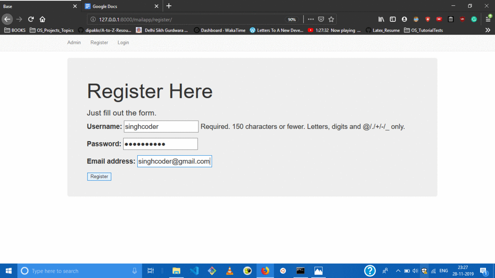

# SecureMails

This project a part of course Cryptography, BITS F463 done at BITS Pilani under Prof. Ashutosh Bhatia.

## Motivation:

+ While sending emails on Gmail we cannot be sure whether the information remains confidential since Google can still access the mails. 
+ We wanted to make sure that the content is only accessible to the desired recipient and no one else has access to the message shared.


## Objective
- A web app to send emails using Gmail but in encrypted format.
- Key exchange implemented through asymmetric cryptography (Elliptic Curve)
- Message encryption by Advanced Encryption Standard (AES) using Stanford Javascript Crypto Library (SJCL).

## Methodology

+ Built UI on the top of the basic UI available [here](https://github.com/jlord/hello)
+ Used SJCL library provided by Stanford for encryption and decryption purposes.
+ Used Django as the backend framework and it’s native SQLite database for storing metadata related to encryption
+ Achieved secure key exchange through asymmetric cryptography (ElGamel through Elliptic Curve).

## Flowchart



## Implementation:

- User registers on the portal.
- User logins into his account and is redirected to the home page.
- The home page contains a text box for typing in the message to be sent and a list of users already registered on the portal navigable through a search box.
- If the user’s public-private key pair does not already exist, a new public-private key pair is generated. Private key is stored in local storage while the public key is stored in the Django database - both in serialized form.
- Otherwise, the private key of the user is retrieved from the local storage and public key from Django database
User selects the recipient from the list as receivers using search box.
- User enters the message and presses the ‘Encrypt’ button.
- If sender-receiver pair session key does not already exist, a symmetric key symKey is created.
- It is encrypted with both users’ public keys (through Elliptic Curve Cryptography)
```
    E(PUa, symKey) = sk_sym1
    E(PUb, symKey) = sk_sym2
```
sk_sym1 and sk_sym2 are stored in the database.
- Otherwise, retrieve sk_sym1 (Encrypted public key of sender) from the database.
- The symmetric key for encrypting the message (session key) is deciphered using
```
    symKey = D(PRa, sk_sym1)
    CT = E(symKey, PT)             (AES)
```
- User is redirected to Gmail to send the encrypted message.
- Receiver logins into the portal and enters in browser the link he receives on GMail and he gets the message decrypted.

### Tech stack used

- HTML, CSS, JS : For frontend
- Python, Django:  For backend
- SJCL (Stanford Javascript Crypto Library): For encrypting and decrypting the messages and for key exchange

- References
    - http://bitwiseshiftleft.github.io/sjcl/doc/
    - https://github.com/bitwiseshiftleft/sjcl
    - https://bitwiseshiftleft.github.io/sjcl/demo/
    - https://courses.csail.mit.edu/6.857/2016/files/37.pdf
    - https://developer.mozilla.org/en-US/docs/Web/API/Window/localStorage

### Overview



## Commit History Visualizer


[video](CommitHistoryVisualizer/SecureMails.mp4)

- Above video is made using 